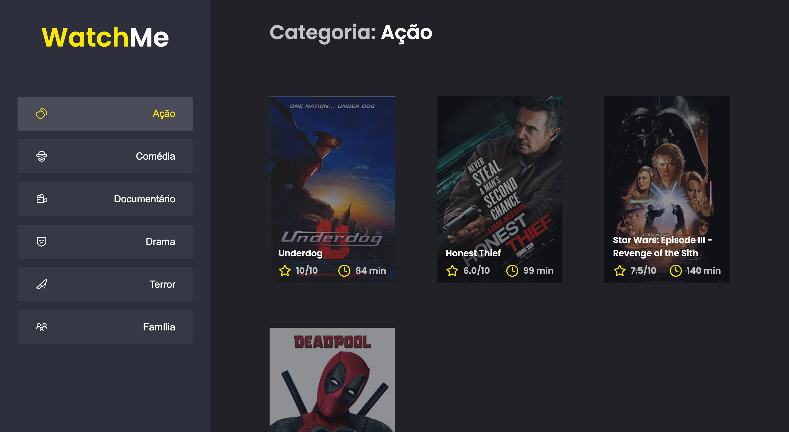

<p align="center">
  

  

  <a href="https://www.twitter.com/wandchavesbr/">
    
  </a>
  
  <a href="https://github.com/wandersonchaves/challenge-02-componentizing-application/commits/master">
    
  </a>
    
   
   <a href="https://github.com/wandersonchaves/challenge-02-componentizing-application/">
    
  </a>

  <a href="https://chav3x.com.br">
    
  </a>
  
  <a href="https://blog.chav3x.com.br/">
    
    </a>
  
 
</p>
<h1 align="center">
    
</h1>

<h4 align="center"> 
	🚧  Componentizing Application ♻️ Concluído 🚀 🚧
</h4>

<p align="center">
 <a href="#-sobre-o-projeto">Sobre</a> •
 <a href="#-funcionalidades">Funcionalidades</a> •
 <a href="#-layout">Layout</a> • 
 <a href="#-como-executar-o-projeto">Como executar</a> • 
 <a href="#-tecnologias">Tecnologias</a> • 
 <a href="#-contribuidores">Contribuidores</a> • 
 <a href="#-autor">Autor</a> • 
 <a href="#user-content--licença">Licença</a>
</p>


## 💻 Sobre o projeto

♻️ Componentizing Application - é uma aplicação onde o seu principal objetivo é refatorar uma página para listagem de filmes de acordo com gênero.

---

## ⚙️ Funcionalidades

- [x] A aplicação possui apenas uma funcionalidade principal que é a listagem de filmes;
- [x] Na sidebar é possível selecionar qual categoria de filmes deve ser listada;
- [x] A primeira categoria da lista (que é "Ação") já deve começar como marcada;
- [x] O header da aplicação possui apenas o nome da categoria selecionada que deve mudar dinamicamente.

---

## 🚀 Como executar o projeto

Este projeto tem uma parte:
1. Frontend

💡O Frontend precisa que o Backend esteja sendo executado para funcionar.

### Pré-requisitos

Antes de começar, você vai precisar ter instalado em sua máquina as seguintes ferramentas:
[Git](https://git-scm.com), [Node.js](https://nodejs.org/en/). 
Além disto é bom ter um editor para trabalhar com o código como [VSCode](https://code.visualstudio.com/)

#### 🎲 Rodando o Frontend

```bash

# Clone este repositório
$ git clone git@github.com:wandersonchaves/challenge-02-componentizing-application.git

# Acesse a pasta do projeto no terminal/cmd
$ cd challenge-02-componentizing-application

# Instale as dependências
$ yarn or yarn install

# Execute a aplicação em modo de desenvolvimento
$ yarn server && yarn dev

# O servidor inciará na porta:3333 - acesse http://localhost:3333 

```

## 🛠 Tecnologias

As seguintes ferramentas foram usadas na construção do projeto:

#### **Website**  ([React](https://reactjs.org/)  +  [TypeScript](https://www.typescriptlang.org/) + [NodeJS](https://nodejs.org/en/))

-   **[React Icons](https://react-icons.github.io/react-icons/)**
-   **[Axios](https://github.com/axios/axios)**
-   **[JSON Server](https://github.com/typicode/json-server)**
-   **[ts-node](https://github.com/TypeStrong/ts-node)**

> Veja o arquivo  [package.json](https://github.com/wandersonchaves/challenge-02-componentizing-application/blob/master/package.json)

#### [](https://github.com/wandersonchaves/challenge-02-componentizing-application#utilit%C3%A1rios)**Utilitários**

-   Markdown:  **[StackEdit](https://stackedit.io/)**,  **[Markdown Emoji](https://gist.github.com/rxaviers/7360908)**
-   Fontes:  **[Roboto](https://fonts.google.com/specimen/Roboto)**

---

## 👨‍💻 Contribuidores

💜 Um super thanks 👏 para essa galera que fez esse produto sair do campo da ideia e entrar nas lojas de aplicativos :)

<table>
  <tr>
    <td align="center"><a href="https://chav3x.com.br"><br /><sub><b>Wanderson Chaves</b></sub></a><br /><a href="https://chav3x.com.br/" title="Chav3x">👨‍🚀</a></td>
  </tr>
</table>

## 💪 Como contribuir para o projeto

1. Faça um **fork** do projeto.
2. Crie uma nova branch com as suas alterações: `git checkout -b my-feature`
3. Salve as alterações e crie uma mensagem de commit contando o que você fez: `git commit -m "feature: My new feature"`
4. Envie as suas alterações: `git push origin my-feature`
> Caso tenha alguma dúvida confira este [guia de como contribuir no GitHub](./CONTRIBUTING.md)

---

## 🦸 Autor

<a href="https://blog.chav3x.com.br/author/wanderson/">
 
 <br />
 <sub><b>Wanderson Chaves</b></sub></a> <a href="https://blog.chav3x.com.br/author/wanderson/" title="Chav3x">🚀</a>
 <br />

[](https://twitter.com/wandchavesbr) [](https://www.linkedin.com/in/wanderson-chaves/) 
[](mailto:wandersonscpibr@gmail.com)

---

## 📝 Licença

Este projeto esta sobe a licença [MIT](./LICENSE).

Feito com ❤️ por Wanderson Chaves 👋🏽 [Entre em contato!](https://www.linkedin.com/in/wanderson-chaves/)

---

##  Versões do README

[Português 🇧🇷](./README.md)  |  [Inglês 🇺🇸](./README-en.md)